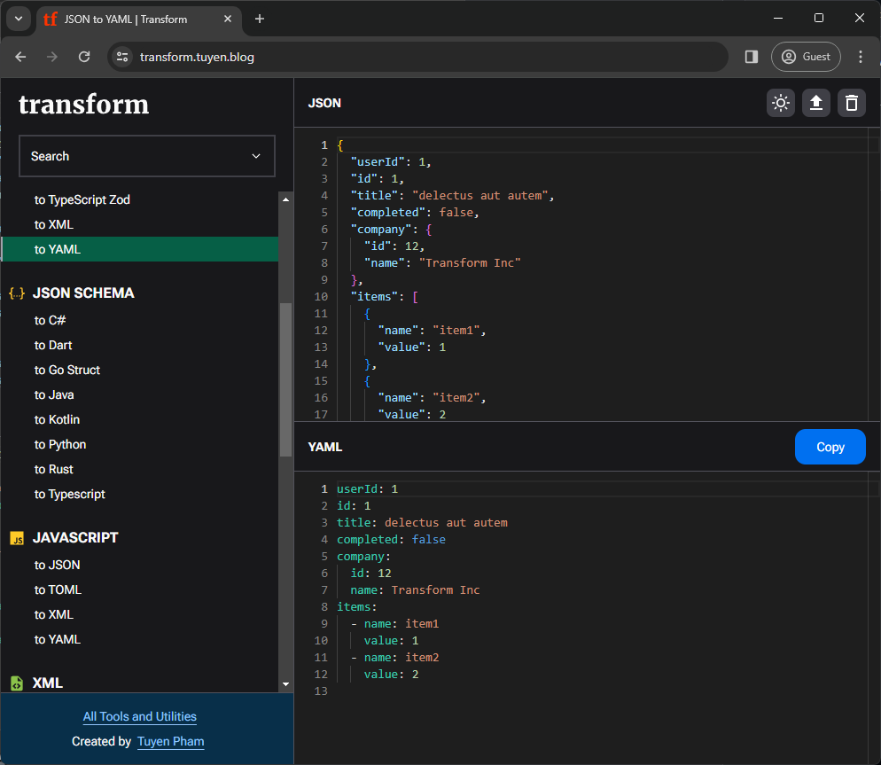
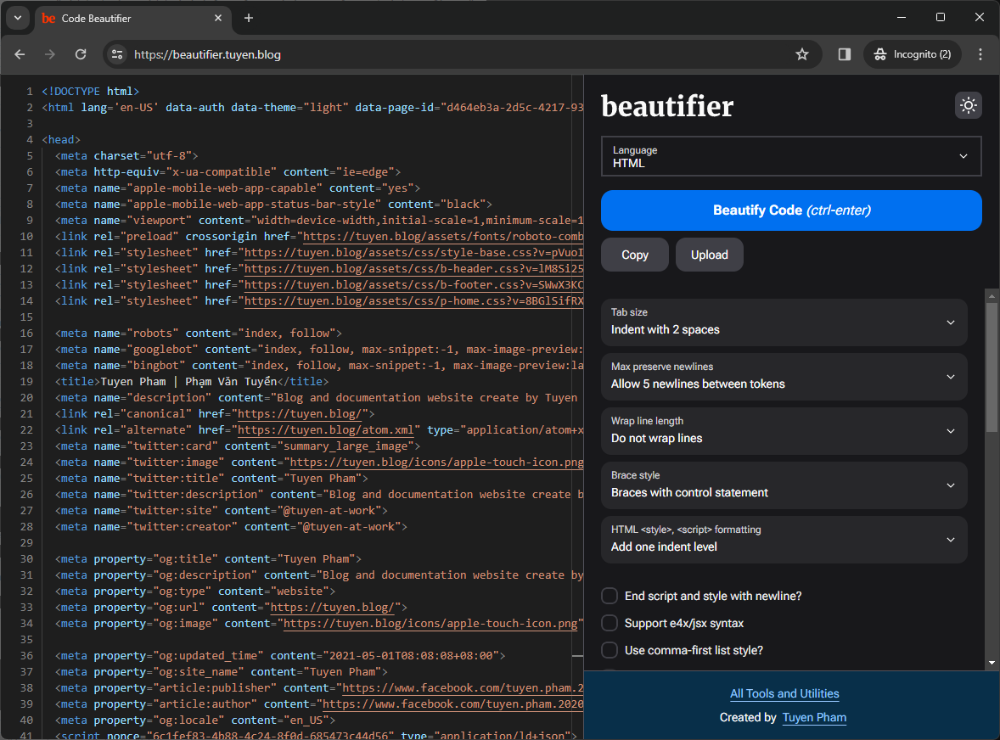
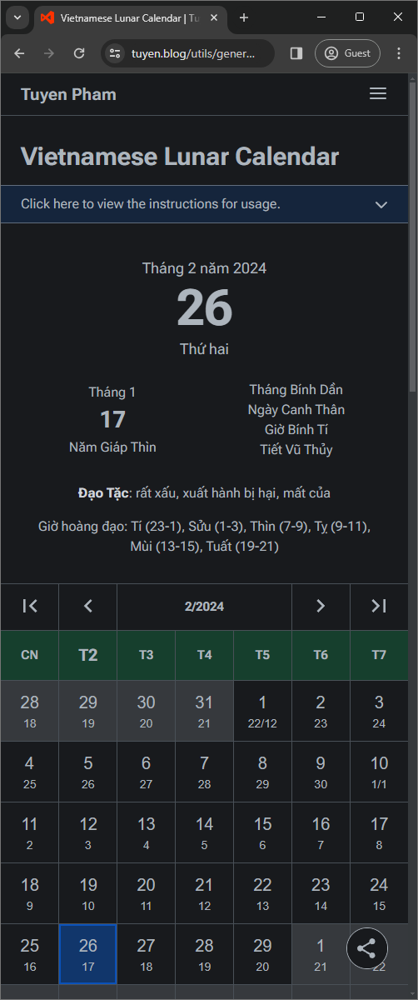

<!-- PROJECT LOGO -->
 

  

  <h1 align="center">Phạm Văn Tuyển</h1>

  

    Manager at Optimizely
     
    <a href="https://tuyen.blog/"><strong>My Home Page »</strong></a>
     
     
    <a href="https://transform.tuyen.blog/">Transform Tools</a>
    ·
    <a href="https://beautifier.tuyen.blog/">Beautifier</a>
    ·
    <a href="https://tuyen.blog/utils/general/color-blender/">Color Blender</a>
  

## About Me

Hi, I'm Tuyen Pham, Manager at Optimizely, Hanoi.

I have strong experience working in Software Development for more than 5 years, with happy customers come from many countries in the world, provide products and services in wide ranges of business, from health care, pharmacy to retails and e-commerce.
You can visit my little

You can visit my little corner at <https://tuyen.blog/>.

(<a href="#top">back to top</a>)

## My Projects

### Transform Tools

  

### Code Beautifier

  

### Vietnamese Lunar Calendar

  

